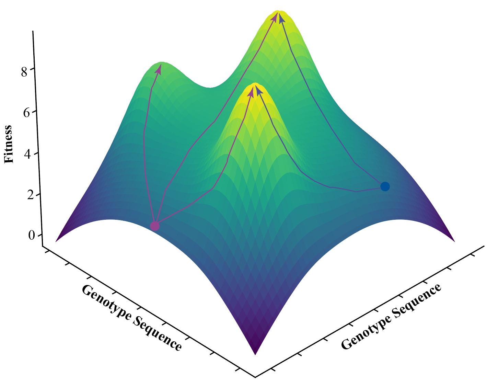

<h1 align="center">Theoretical Fitness Landscapes</h1>

Code and tools to generate and analyze theoretical fitness landscapes (NK model, House of Cards model, Rough Mountain Fuji model).  

This repository provides Python code to simulate and analyze theoretical fitness landscapes with a focus on **DNA sequence evolution**. The models are designed to study the adaptive processes and accessibility of high-fitness peaks in complex landscapes.  

## **Fitness Landscape Diagram**  

<p align="center">
  
</p>
<p align="center">
  <i>A landscape diagram illustrating the adaptive walk</i>
</p>


## **Key Features**  
The repository includes implementations of the following models:  

### **1. NK Model**  
- Generates fitness landscapes with tunable ruggedness, controlled by the parameter \( K \) (epistatic interactions among positions).  
- Each position in the sequence can take one of four states, corresponding to the four nucleotide bases: **A, T, C, G**.  
- Example: A sequence of **9 base pairs (9bp)** with \( K = 2 \) models intermediate ruggedness with local correlations.  

### **2. House of Cards (HoC) Model**  
- Assigns completely random fitness values to genotypes.  
- Ideal for modeling highly unpredictable and unstructured fitness landscapes.  
- Example: For a **9bp** DNA sequence, all possible \( 4^9 \) genotypes (262,144 combinations) are assigned random fitness values.  

### **3. Rough Mountain Fuji (RMF) Model**  
- Combines a smooth fitness gradient (akin to a fitness slope) with random noise to simulate rugged landscapes with a global optimum.  
- Configured to simulate DNA sequences with **9bp**, where each position can independently evolve to maximize overall fitness.  
- The ruggedness of the landscape is controlled by the standard deviation (\( σ \)) of the added noise.  
---

## **Focus on DNA Sequence Simulation**  
All models are designed to simulate DNA sequences of **9 base pairs (9bp)**.  
Each position in the sequence has **4 possible states**, representing the nucleotide bases:  
1. **A** (Adenine)  
2. **T** (Thymine)  
3. **C** (Cytosine)  
4. **G** (Guanine)  

By defining fitness landscapes based on DNA sequences, this repository enables the study of evolutionary dynamics, adaptive pathways, and the combinatorial complexity of genetic systems.  

---

## **Getting Started**  
1. Clone the repository:  
   ```bash
   git clone https://github.com/yangli-evo/theoretical-fitness-landscapes.git
   cd theoretical-fitness-landscapes

## 📌 Contact & Citation
- **For any questions, please email:** yangli-evo@gmail.com  
- **If you find this method useful, please cite:**  
**Li, Yang., & Zhang, Jianzhi. (2025).**  
*On the probability of reaching high peaks in fitness landscapes by adaptive walks.*  
**Molecular Biology and Evolution, msaf066.** [https://doi.org/10.1093/molbev/msaf066](https://doi.org/10.1093/molbev/msaf066)
